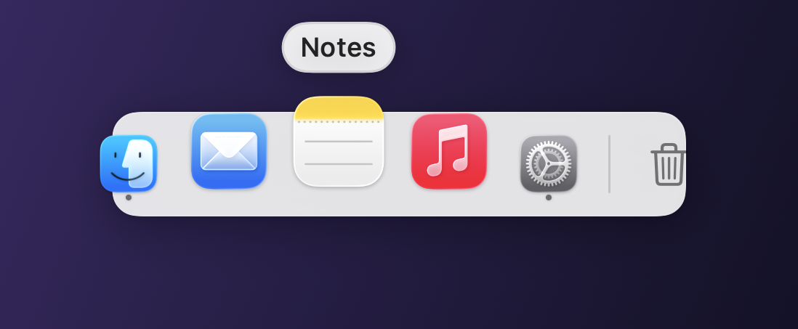
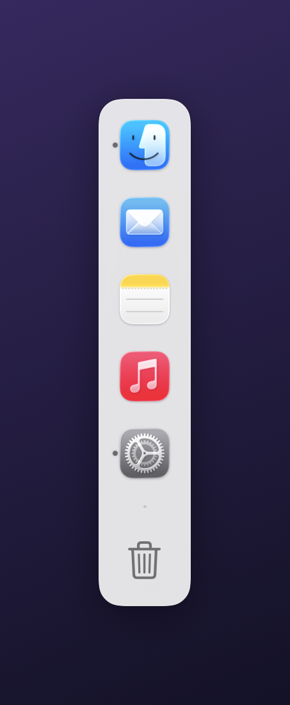

# pier

**Free, native macOS docks. As many as you want, pinned wherever you want.**
Replaces [ExtraDock](https://extradock.app) (€9.99/year, or €39.99 once).

> Part of [Openware](https://github.com/openwarehq) — real, self-hostable replacements for software that shouldn't cost anything. Not affiliated with ExtraDock or Appit Studio. Written from scratch against the idea, never against their code or assets.



<sub>Icons magnify under the pointer, running apps get a dot, and dividers and widgets sit in the same row. Blur is composited by the window server, so it can't be captured offscreen — the real thing is translucent.</sub>

---

## Why this exists

macOS gives you one Dock. On two monitors it either lives on one screen or follows your
pointer around, and neither is what you want when the left screen is for chat and the
right one is for code.

Pier gives you as many docks as you like, each pinned to a display, each with its own
contents, position and look. They sit alongside the real Dock or replace it.

**It asks for nothing.** No Accessibility prompt, no Full Disk Access, no account, no
network. Pointer position is the only thing it watches, and macOS lets any app watch the
*mouse* without permission — only the keyboard needs one.

## What it does

- **As many docks as you want**, each with its own items, size, colours and behaviour
- **Pinned per display** — and a dock whose monitor is unplugged goes away with it instead of piling onto whatever's left
- **Any edge, or nowhere in particular** — top, bottom, left, right, or drag it into open space and it stays there. Drop it near an edge and it snaps
- **Magnification** with a proper falloff curve, growing away from the edge it's docked against
- **Running indicators** and a launch bounce
- **Drag and drop that works both ways** — drag apps, folders and files onto a dock to add them; drag a file onto an app to open it with that app; onto a folder to move it in; onto the Trash to bin it. Drag icons to reorder, or off the dock to remove
- **Widgets**: clock, Trash, Finder, screen name, IP address, spacers and dividers
- **Per-app custom icons** — point at any image and that's the icon
- **Auto-hide** with a reveal band at the screen edge, and **hide on full screen**
- **Collapse to a button** when you want the space back
- **Mirror the macOS Dock** to fill a new dock with what's already in yours
- Deep customisation: icon size, spacing, padding, corner radius, opacity, blur material, tint, border, shadow, labels, indicators
- Runs at about 1% CPU sitting still



## What it doesn't do

- **No notification badges.** The unread count on an app's Dock icon isn't published by macOS to anyone but the Dock. Faking it would mean guessing, so Pier doesn't show one
- **Mirroring is a snapshot, not a live feed.** Switching on "mirror the macOS Dock" copies its contents at that moment; it doesn't follow along afterwards
- **No mascot, no pet, no Tamagotchi.** ExtraDock has one and people love it. This is a dock
- **Not notarized, no signed DMG.** You build it from this folder. It's ad-hoc signed on your own machine, which is why Gatekeeper never gets involved
- **Windows don't resize around it** the way they do for the real Dock — macOS reserves screen space for its own Dock and nobody else's
- **macOS 13+.** No iOS, no Windows, no Linux

## Build it

```bash
git clone https://github.com/openwarehq/pier
cd pier
./build.sh
open Pier.app
```

Needs Xcode or the Command Line Tools; no Xcode project, no signing identity, no
`pod install`, no npm. The build compiles the app, **draws its own icon** with CoreGraphics
(this repo ships no binary art), assembles `Pier.app` and ad-hoc signs it.

Move it to `/Applications` if you keep it. Everything else happens from the menu bar icon.

## Using it

| | |
|:--|:--|
| **Right-click a dock** | Add apps, folders and widgets, change an icon, open its settings |
| **Drag onto a dock** | Adds whatever you dropped, at the point you dropped it |
| **Drag an icon off** | Removes it — the same gesture the real Dock uses |
| **Drag the dock itself** | Moves it. Near an edge it snaps; in open space it stays put |
| **Menu bar icon** | Every dock, show/hide, duplicate, remove, and settings |

## Where your things live

```
~/Library/Application Support/Pier/docks.json
```

One file. It's plain JSON, and if you corrupt it Pier keeps the broken copy next to it as
`docks.json.broken` rather than quietly starting over.

## Hacking on it

```bash
swift test     # 59 tests over the pure logic — no window server involved
swift build    # debug build without assembling the bundle
```

The package splits in two on purpose:

- **`PierCore`** — Foundation only. The dock and item model, persistence, and the three
  pieces of arithmetic everything else depends on: `DockLayout` (tile frames, hit testing,
  insertion points), `Magnifier` (the swell under the pointer) and `DockPlacement` (where a
  dock sits, where it hides, which edge it snaps to). All testable without a screen.
- **`Pier`** — AppKit and SwiftUI. Panels, drag plumbing, the menu bar, settings.

Every position in a dock comes from `DockLayout`, so the SwiftUI drawing and the AppKit
hit-testing can't disagree about where a tile is.

To look at a dock without one being on screen:

```bash
./Pier.app/Contents/MacOS/Pier --render-preview ~/Desktop
```

---

MIT. Take it, fork it, sell it.
